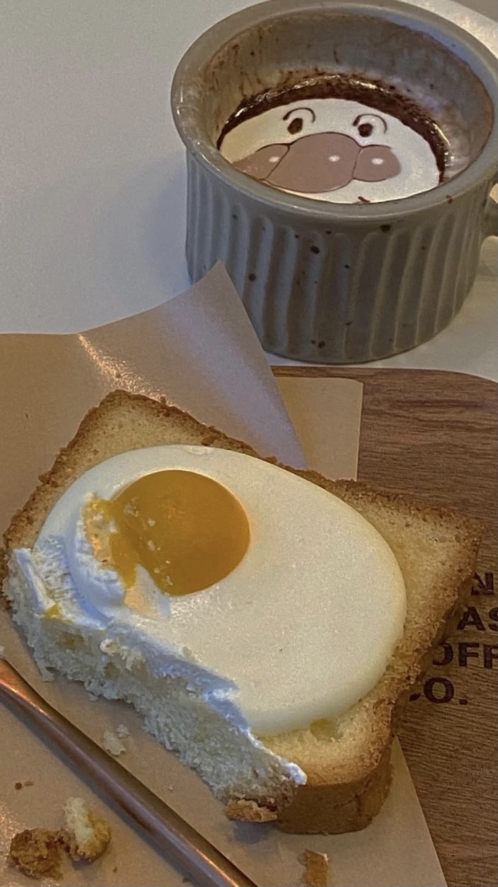
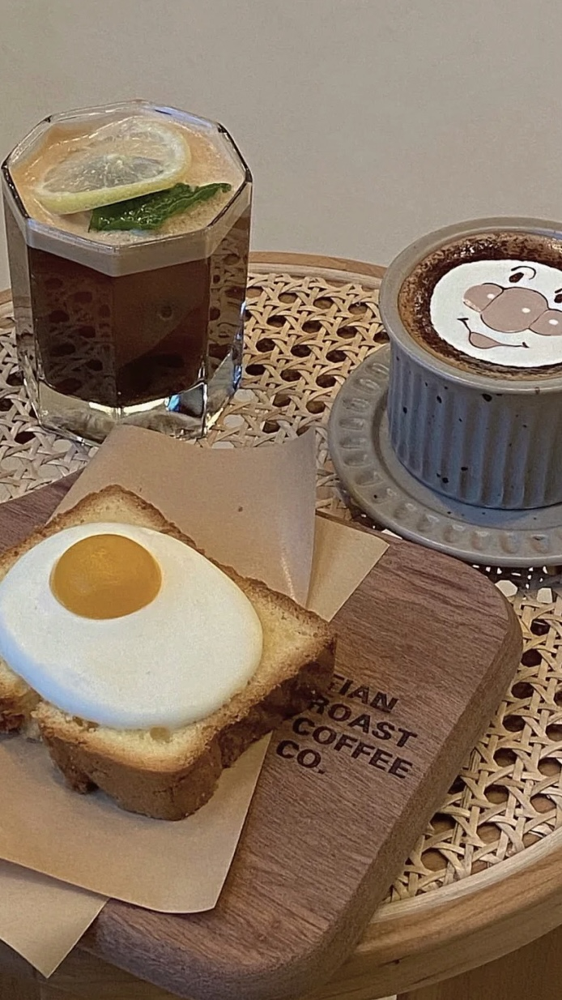
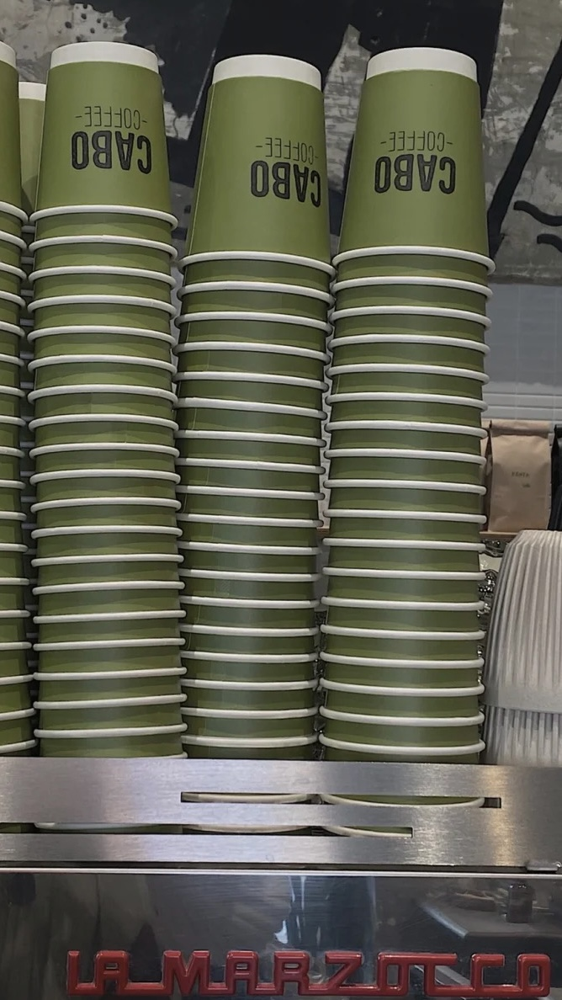

  <head>
    	<title>Beijing Coffee Map</title>
</head>  

<body>	
	
 

         
  
 <h1 id="Welcome">Welcome</h1>

  <h1><i>to <a href="Jessica">Jessica Nie</a>'s page!</i></h1>
                               

                            

Location: China, Beijing  
	Photo by Jessica Nie 

 <body style="background-color:lightblue;">
<figure class="hover-menu">

  

    <a href="#">FIND MORE</a>
    <a href="#">FLAVOUR</a>
    <a href="#">ABOUT</a>
  

</figure>

<h3 style="border: 5px solid orange;">CAFE MAP</h3>
<h3 style="border: 5px solid green;">MENU</h3>
<h3 style="border: 5px solid purple;">LOCATION</h3>

<h1>TianROAST</h1>

Location: 798 street

  
  
photo 1

  
  
photo 2

  
  
photo 3

  
  
photo 4

<h1>CABO CAFE</h1>

Location:  Tiantan, Beijing street No.13 

    	

  
  
photo 5

  
  
photo 6

  
  
photo 7

  
  
photo 8

</body>
